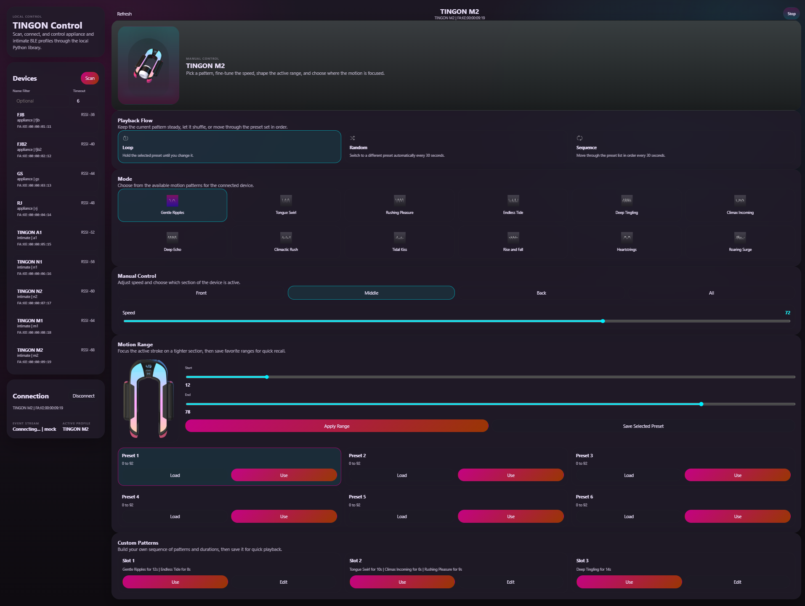
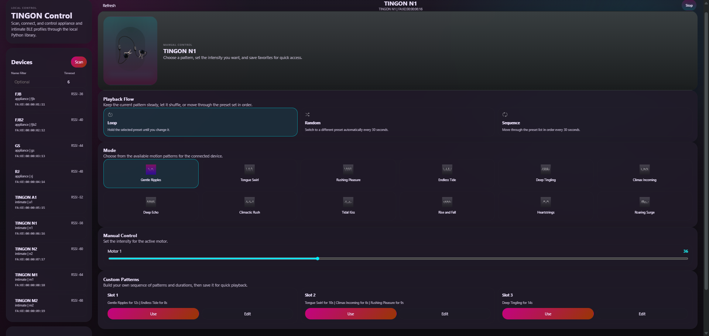
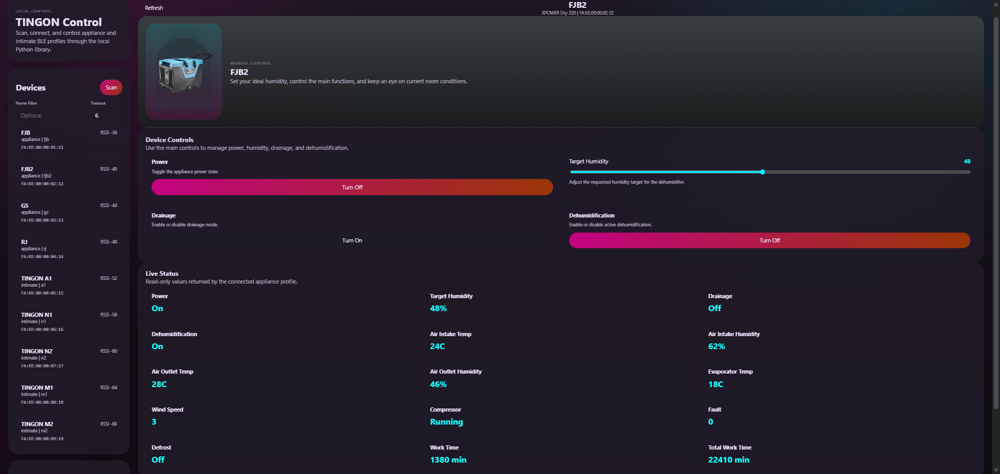

# TINGON BLE Tools

Python tooling for reverse-engineered TINGON BLE devices.

Distribution name: `tingon-py`  
Python import package: `tingon_py`

Installed console commands:

- `tingon`
- `tingon-web`

## Project Layout

Main files and folders:

- [tingon_py](C:\Users\seanh\Desktop\tingon\tingon_py) - Python package
- [tingon_py/core.py](C:\Users\seanh\Desktop\tingon\tingon_py\core.py) - shared BLE logic, profiles, protocols, device control, and mock support
- [tingon_py/cli.py](C:\Users\seanh\Desktop\tingon\tingon_py\cli.py) - CLI entrypoint
- [tingon_py/webapp.py](C:\Users\seanh\Desktop\tingon\tingon_py\webapp.py) - web entrypoint
- [tingon_py/webapp_impl.py](C:\Users\seanh\Desktop\tingon\tingon_py\webapp_impl.py) - FastAPI app and session manager
- [tingon_py/web](C:\Users\seanh\Desktop\tingon\tingon_py\web) - packaged web UI files
- [PROTOCOL.md](C:\Users\seanh\Desktop\tingon\PROTOCOL.md) - BLE protocol reference for intimate and appliance devices
- [pyproject.toml](C:\Users\seanh\Desktop\tingon\pyproject.toml) - package metadata and console-script definitions

## Supported Devices

Appliance profiles:

- `fjb` - XPOWER dehumidifier
- `fjb2` - XPOWER dehumidifier, second generation
- `gs` - Wanhe water heater
- `rj` - Wanhe water heater

Intimate-device profiles:

- `a1` - TINGON A1
- `n1` - TINGON N1
- `n2` - TINGON N2
- `m1` - TINGON M1
- `m2` - TINGON M2

## Requirements

```bash
pip install -e .
pip install -e .[web]
```

Base installs include the BLE client only. The web UI dependencies are optional and only required for `tingon-web`.

## Library Usage

Supported public library surface:

- `tingon_py.TingonClient`
- `tingon_py.scan`
- `tingon_py.DeviceProfile`
- `tingon_py.profile_info`
- `tingon_py.TingonError` and typed subclasses

Example:

```python
import asyncio

from tingon_py import DeviceProfile, TingonClient, scan


async def main():
    devices = await scan(timeout=5)
    client = TingonClient()
    await client.connect("AA:BB:CC:DD:EE:FF", profile=DeviceProfile.FJB)
    try:
        status = await client.get_status()
        print(status)
    finally:
        await client.disconnect()


asyncio.run(main())
```

## Web UI

Start the local frontend:

```bash
pip install -e .[web]

tingon-web
tingon-web --mock
tingon-web --host 0.0.0.0 --port 8765

python -m tingon_py.webapp
python -m tingon_py.webapp --mock
python -m tingon_py.webapp --host 0.0.0.0 --port 8765
```

Then open `http://127.0.0.1:8765`.

Current web UI scope:

- appliance and intimate profiles in one local UI
- appliance screens for `fjb`, `fjb2`, `gs`, and `rj`
- intimate screens for `a1`, `n1`, `n2`, `m1`, and `m2`
- local scan, connect, disconnect, live control, status refresh, and intimate custom slot editing
- optional mock BLE mode with deterministic test devices for every supported profile

## Scan

```bash
tingon scan
tingon scan --timeout 5

python -m tingon_py.cli scan
python -m tingon_py.cli scan --timeout 5
```

## Basic Usage

Query status:

```bash
tingon status AA:BB:CC:DD:EE:FF --profile fjb
tingon status AA:BB:CC:DD:EE:FF --profile m2

python -m tingon_py.cli status AA:BB:CC:DD:EE:FF --profile fjb
python -m tingon_py.cli status AA:BB:CC:DD:EE:FF --profile m2
```

Control appliance devices:

```bash
tingon power AA:BB:CC:DD:EE:FF on --profile fjb
tingon humidity AA:BB:CC:DD:EE:FF 50 --profile fjb2
tingon temp AA:BB:CC:DD:EE:FF 42 --profile gs
tingon mode AA:BB:CC:DD:EE:FF kitchen --profile rj
tingon provision AA:BB:CC:DD:EE:FF MyWifi password123 --profile fjb

python -m tingon_py.cli power AA:BB:CC:DD:EE:FF on --profile fjb
python -m tingon_py.cli humidity AA:BB:CC:DD:EE:FF 50 --profile fjb2
python -m tingon_py.cli temp AA:BB:CC:DD:EE:FF 42 --profile gs
python -m tingon_py.cli mode AA:BB:CC:DD:EE:FF kitchen --profile rj
python -m tingon_py.cli provision AA:BB:CC:DD:EE:FF MyWifi password123 --profile fjb
```

Control intimate devices:

```bash
tingon play AA:BB:CC:DD:EE:FF on --profile m2 --mode 1
tingon motor AA:BB:CC:DD:EE:FF 70 30 --profile m1
tingon motor AA:BB:CC:DD:EE:FF 60 --profile a1
tingon position AA:BB:CC:DD:EE:FF front --profile m2
tingon n2-mode AA:BB:CC:DD:EE:FF vibration --profile n2
tingon custom-get AA:BB:CC:DD:EE:FF 32 --profile m2
tingon custom-set AA:BB:CC:DD:EE:FF 32 1:10 2:20 3:15 --profile n2

python -m tingon_py.cli play AA:BB:CC:DD:EE:FF on --profile m2 --mode 1
python -m tingon_py.cli motor AA:BB:CC:DD:EE:FF 70 30 --profile m1
python -m tingon_py.cli motor AA:BB:CC:DD:EE:FF 60 --profile a1
python -m tingon_py.cli position AA:BB:CC:DD:EE:FF front --profile m2
python -m tingon_py.cli n2-mode AA:BB:CC:DD:EE:FF vibration --profile n2
python -m tingon_py.cli custom-get AA:BB:CC:DD:EE:FF 32 --profile m2
python -m tingon_py.cli custom-set AA:BB:CC:DD:EE:FF 32 1:10 2:20 3:15 --profile n2
```

Interactive session:

```bash
tingon interactive AA:BB:CC:DD:EE:FF --profile m2

python -m tingon_py.cli interactive AA:BB:CC:DD:EE:FF --profile m2
```

Raw command send:

```bash
tingon raw AA:BB:CC:DD:EE:FF 0A0101 --profile m2

python -m tingon_py.cli raw AA:BB:CC:DD:EE:FF 0A0101 --profile m2
```

## Notes

- Appliance devices use a TLV/spec protocol over `ee01/ee02/ee04` plus `cc01/cc02/cc03` for status queries.
- Intimate devices reuse `ee01/ee02/ee04` but use a different command family (`0A..`, `0B..`).
- BLE writes require the target device to be powered on and in range.

## Screenshots

Current local web UI examples:






